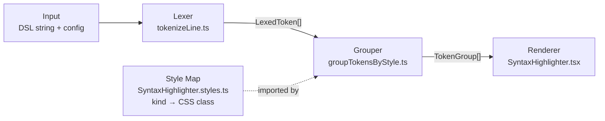

# Semantic Code Renderer

A custom syntax-highlighting pipeline for JS-like DSLs, built for React. Renders code as styled `<span>` groups with context-aware coloring, colon promotion, and delimiter-triggered spans — capabilities that off-the-shelf highlighters cannot express without grammar hacking.

**Live demo:** [semantic-code-renderer](https://oussama-tr.github.io/semantic-code-renderer/)

---

## Features

- **Ordered regex tokenizer** — a single named-capture-group regex classifies every token. Group ordering is load-bearing: configured function keys take priority over generic identifiers so they are never misclassified.
- **Three-mode state machine** — the grouper runs regular merge, colon-isolation, and special-value modes. Transitions are driven by the previous token's _kind_, not its CSS class, keeping logic and presentation fully decoupled.
- **Semantic trigger detection** — special-value spans activate only when a trigger key carries `"default"` kind, preventing false positives on keywords or function keys that share the same name.
- **Span coalescing** — consecutive same-kind tokens merge into one `<span>` in a single pass, minimising DOM nodes.
- **Swappable style layer** — tokens carry an abstract `kind`; a single static map resolves kinds to Tailwind classes. Swap the map to retheme without touching the pipeline.

---

## Usage

```tsx
import SyntaxHighlighter from "@/components/SyntaxHighlighter/SyntaxHighlighter";
import { tokenStyles } from "@/components/SyntaxHighlighter/SyntaxHighlighter.styles";

<SyntaxHighlighter
  data={`const widget = {
  label: "demo",
  handler: function() { return true; },
  info: A short description,
};`}
  functionKeys={["handler"]}
  specialValues={[{ triggerKey: "info", valueColor: tokenStyles.description }]}
/>
```

### Props

| Prop            | Type                   | Description                                                                                                                                                                               |
| --------------- | ---------------------- | ----------------------------------------------------------------------------------------------------------------------------------------------------------------------------------------- |
| `data`          | `string`               | Raw DSL source. Each line is rendered in its own `<div>`.                                                                                                                                 |
| `functionKeys`  | `string[]`             | Identifiers styled as function keys. Their immediately following colon receives the same style. Pass a stable reference to avoid unnecessary regex rebuilds.                              |
| `specialValues` | `SpecialValueConfig[]` | When a `triggerKey` with `"default"` kind precedes a colon, subsequent tokens accumulate under `valueColor` until the `terminator` (default `","`) appears as the last token on the line. |

---

## Architecture



Every stage is a pure function. The grouper (`groupTokensByStyle.ts` + `grouping.ts`) operates on abstract token kinds — it never produces JSX. The Style Map is a static import, not a pipeline step; changing the colour scheme requires touching only that file.

---

## Testing

35 tests across unit and component suites (Jest + React Testing Library):

- **Lexer** — token classification for every kind, multi-char operators, whitespace encoding, and edge-case delimiters.
- **Grouper** — all three modes: regular merging, colon isolation, special-value activation and termination.
- **Trigger semantics** — spans activate only when the trigger key has `"default"` kind; mid-line terminators do not flush.
- **Component integration** — margin classes and styled spans verified against rendered DOM.
